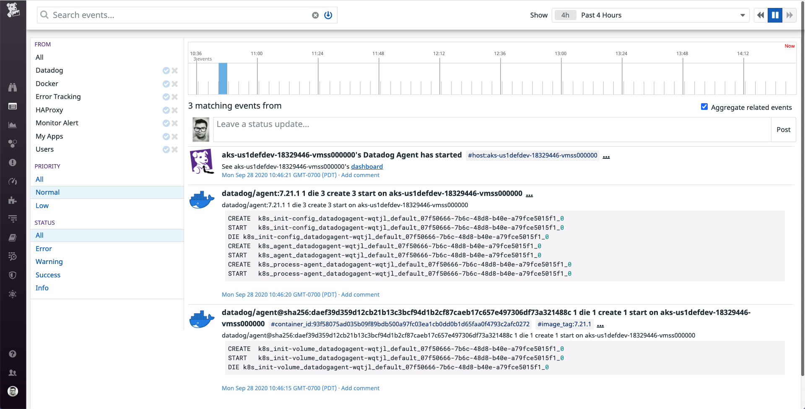
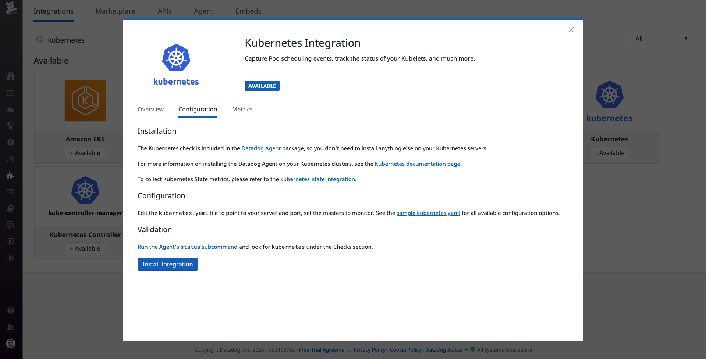
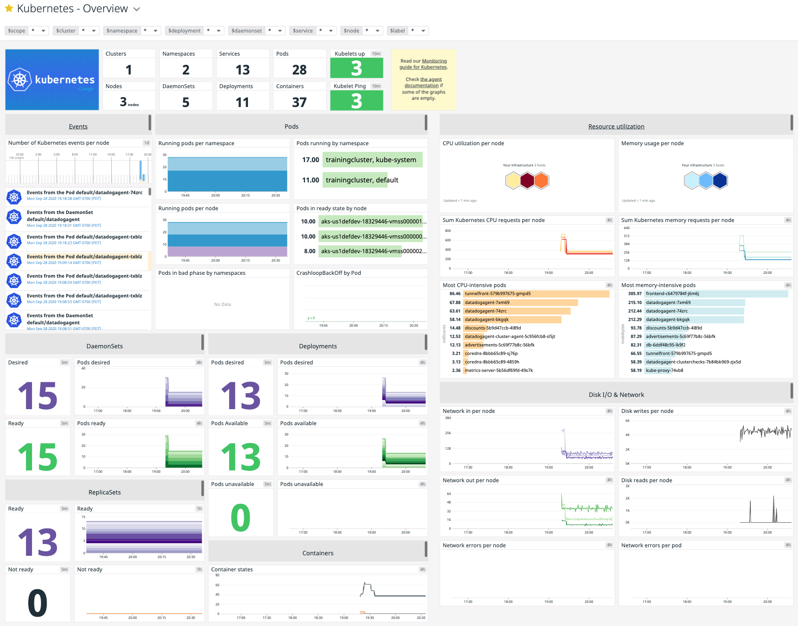
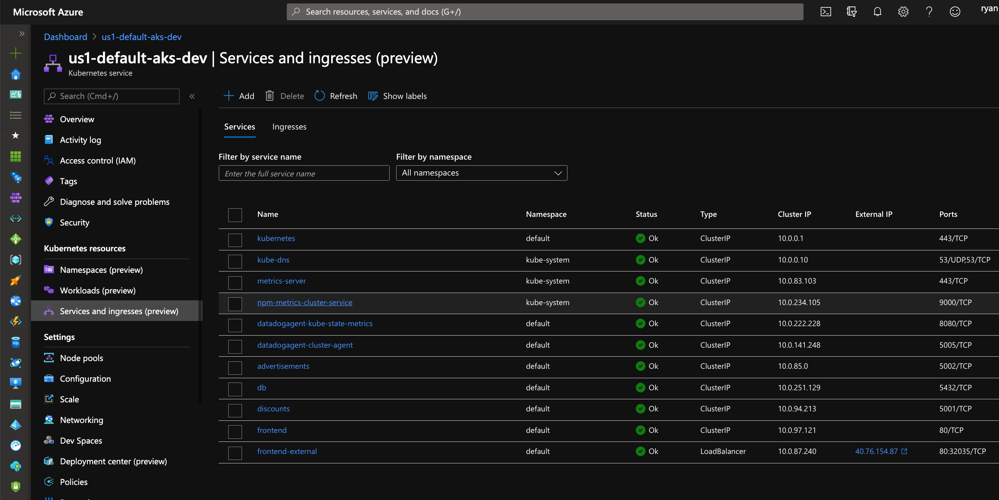
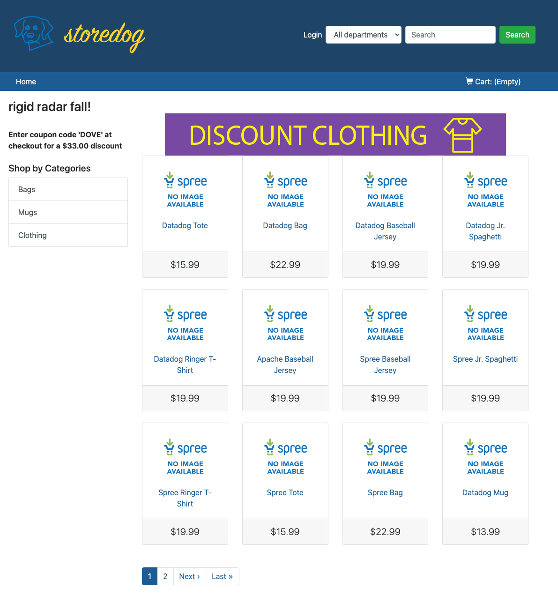

# Monitoring Kubernetes with Datadog / Intro to Datadog for CNHH

Some useful commands as we run through the hands-on portion.

## Azure Integration Steps

### Set Up Service Principal

### Add Service Principal to Datadog

## For Azure Cloud Shell

### Helm

[Helm chart link - dtdg.co/ddhelm](http://dtdg.co/ddhelm)

Clone this repository, then `cd` to that folder:

```bash
git clone https://github.com/ryanmaclean/k8s-dd-cnhh.git
cd k8s-dd-cnhh
```

Add the helm repository:
```bash
helm repo add datadog https://helm.datadoghq.com
helm repo add stable https://kubernetes-charts.storage.googleapis.com/
helm repo update
```

1. Export the _API_ key:

Get the API from https://app.datadoghq.com/account/settings#api and paste it after the `=` sign in the following example:
`export DD_API_KEY=KEY_FROM_DATADOG`

2. Export the _APP_ key:

`echo DD_APP_KEY`

Get the API from https://app.datadoghq.com/account/settings#api scroll to the section after API for the APP keys, and paste it after the `=` sign in the following example:
`export DD_APP_KEY=KEY_FROM_DATADOG`

3. Once both have been confirmed, you can then install the agent:
```bash
helm install datadogagent \
 --set datadog.apiKey=$DD_API_KEY \
 --set datadog.appKey=$DD_APP_KEY \
 -f k8s-yaml-files/values.yaml datadog/datadog
 ```
 
Things should now be appearing in Datadog, but we'll also want to ensure that we get the kubernetes metrics as well. To do so, open the values.yaml file we used previously, and around line 276, remove the `[]` after the `env` line, and add the following the following text:
```yaml
  env:
    - name: "DD_KUBELET_TLS_VERIFY"
      value: "false"
```

Then we'll re-apply our helm chart in order to update it: 
```bash
helm upgrade datadogagent \
 --set datadog.apiKey=$DD_API_KEY \
 --set datadog.appKey=$DD_APP_KEY \
 -f k8s-yaml-files/values.yaml datadog/datadog
```

We should now see the some of the infrastructure start to come online in Datadog. Note that it may take a couple of minutes, but will eventually look like the following: 




### Let's Break Some Things!
Edit the [`values.yaml`](k8s-yaml-files/values.yaml) file once again in your editor. At lines 796~800, we'll set the CPU to 20 millicores and RAM to 32 mibibytes - much lower than they should be, but will help us see what happeneds when resources are low. 

The resulting section should look like this: 

```yaml
 resources: 
   requests:
     cpu: 20m
     memory: 32Mi
   limits:
     cpu: 20m
     memory: 32Mi
```

Run helm again to upgrade: 
```bash
helm upgrade datadogagent \
 --set datadog.apiKey=$DD_API_KEY \
 --set datadog.appKey=$DD_APP_KEY \
 -f k8s-yaml-files/values.yaml datadog/datadog
```

Open the event stream to confirm the problems we'd expect: https://app.datadoghq.com/event/stream

### Reverting our Changes! 
Normally we'd take care of this in the lab by re-provisioning, but for those running their own clusters, feel free to simply re-download the YAML and upgrade via helm once more: 

```bash
wget https://raw.githubusercontent.com/helm/charts/master/stable/datadog/values.yaml
mv values.yaml k8s-yaml-files/
helm upgrade datadogagent \
 --set datadog.apiKey=$DD_API_KEY \
 --set datadog.appKey=$DD_APP_KEY \
 -f k8s-yaml-files/values.yaml datadog/datadog
```

### Cluster Agent
We'll now deploy the cluster agent - in the values.yaml file, the block around line 390 contains the cluster agent config. Change the `false` on line 397 to `true`, then save and upgrade the cluster once more. (Last time, I promise!) Hint: you can use `code k8s-yaml-files/values.yaml` to open it in the embedded VS Code editor, just remember to hit cmd+s (on macOS) or ctrl+s (Linux/Windows) to save the file before continuing. 

It should look like this when you're done:

```yaml
clusterAgent:
  ## @param enabled - boolean - required
  ## Set this to true to enable Datadog Cluster Agent
  #
  enabled: true
```

Once it's saved, we'll run the familiar upgrade command via helm, though note we'll replace this with the `values_full.yaml` version which enables a few more parameters:

```bash
helm upgrade datadogagent \
 --set datadog.apiKey=$DD_API_KEY \
 --set datadog.appKey=$DD_APP_KEY \
 -f k8s-yaml-files/values.yaml datadog/datadog
```

## Exploring Kubernetes in Datadog

Note that though we now have data in Datadog, we also need to configure the integration. This can be done via the integrations page, specifically in the Kubernetes integration tab: https://app.datadoghq.com/account/settings#integrations/kubernetes

In the "configuration" tab, click "Install Integration" (as pictured below) - we've done the heavy lifting already. 


Once we have the Kubernetes Integration installed, we can then explore the [Kubernetes default dashboards](https://app.datadoghq.com/screen/integration/86/kubernetes-overview) in Datadog.



## Deploy Storedog
We've created a sample app to allow us to look at other Datadog services. 

The manifests for this application can be found in the [storedog](storedog/) subfolder. 

In order to launch all of the microservices at once, the following command will apply all of the yaml files in that folder:

```bash
kubectl apply -f storedog/.
```

### Check Containers in Datadog
The containers we've just launched should now also be viewable in [Datadog's container view](https://app.datadoghq.com/containers). 

### Grab the URL for Storedog
Back in the Azure portal, you can now get the IP address for our storedog frontend. Note that it's just an IP for now as we're testing, but we can add a DNS record for these when required. 



### Check out Storedog
Storedog, our microservices app, launched in AKS, is now reachable via the IP we grabbed above. We'll check it out for now, but we'll use this in our next section within Datadog. 



# END HERE CONTINUE WITH DEMO IN DATADOG
